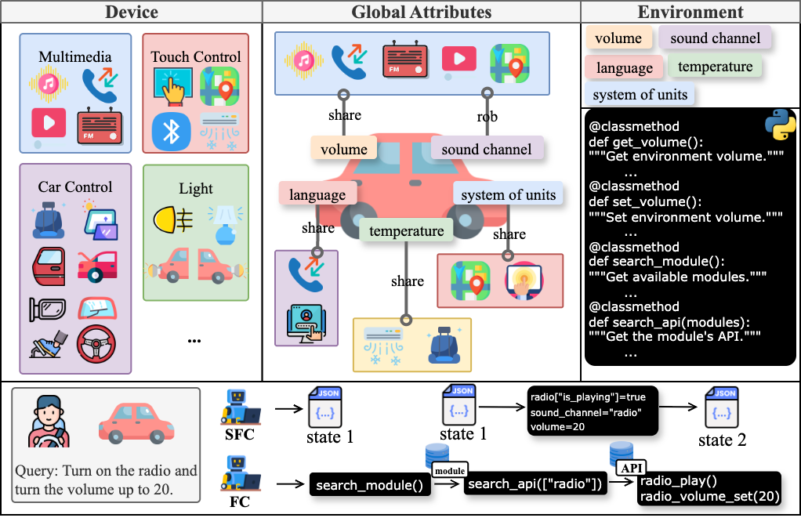
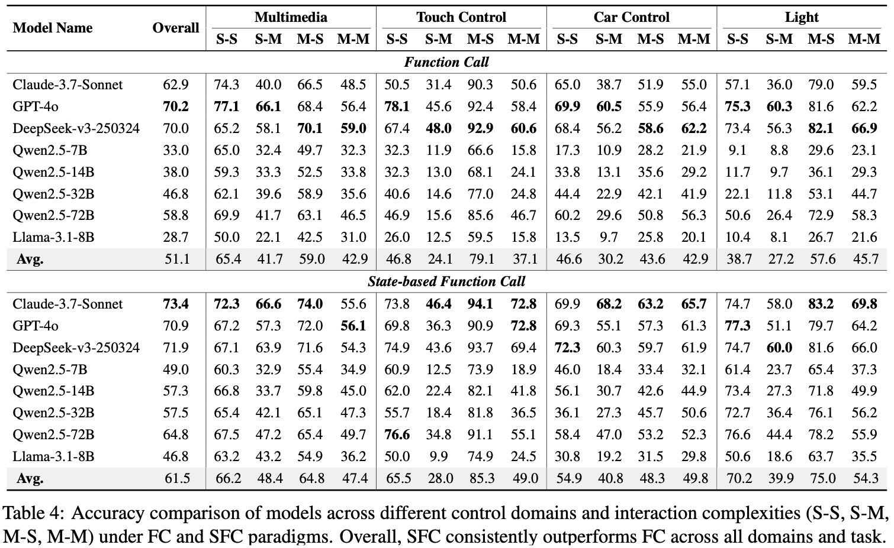
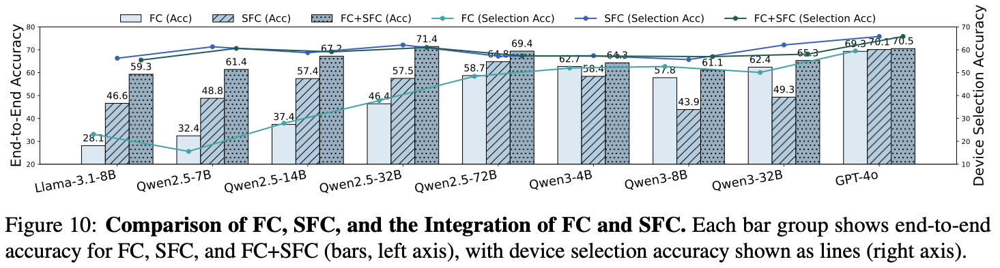

<div align="center">

# 🚗 VehicleWorld
### A Highly Integrated Multi-Device Environment for Intelligent Vehicle Interaction

[](https://arxiv.org/abs/2509.06736)
[](https://emnlp.org/)
[](https://www.python.org/downloads/)

[**📖 Paper**](https://arxiv.org/abs/2509.06736) | [**🚀 GitHub**](https://github.com/OpenMOSS/VehicleWorld)

</div>

---

## 🌟 Overview

**VehicleWorld** is the first comprehensive multi-device environment for intelligent vehicle interaction that accurately models the complex, interconnected systems in modern cockpits. Our environment enables precise evaluation of agent behaviors by providing real-time state information during execution.

<p align="center">

</p>

### 🎯 Key Features

- **🔧 30 Modules** - Comprehensive vehicle subsystems
- **🛠️ 250 APIs** - Rich functionality coverage  
- **📊 680 Properties** - Detailed state management
- **⚡ Real-time Execution** - Live state feedback
- **🌐 Environmental Awareness** - Real-time world state access

---

## 💡 Core Innovations

### 🧠 State-based Function Call (SFC)

Our analysis revealed that **directly predicting environment states** proves more effective than predicting function calls in complex, state-dependent systems. This led to our novel **State-based Function Call (SFC)** approach.

<p align="center">

</p>

### 🔄 Hybrid FC+SFC Approach

We discovered complementary strengths:
- **SFC**: Excels at device selection (global environmental perception)
- **FC**: More efficient for complex state transitions (high-level APIs)

Based on these observations, we analyze the integration of two approaches (FC+SFC): leveraging SFC's environment perception capability for device selection, then providing relevant device APIs for FC-based calls.

<p align="center">

</p>

---

## 🔥 News & Updates

| Date | Update |
|------|--------|
| **🎉 2025/08/21** | Paper accepted to **EMNLP 2025 Findings** |
| **🚀 2025/09/09** | VehicleWorld dataset and evaluation framework released |

---

## 🚀 Quick Start

### Prerequisites
```bash
conda create -n VehicleWorld python=3.10
conda activate VehicleWorld
pip install -r requirements.txt
```

### 🛠️ Data Construction
```bash
cd vehicleworld/database
python task_construct.py
```
📁 Generated tasks → `vehicleworld/database/tasks`

---

## 🎮 Evaluation Methods

Our framework supports **multi-threaded execution** with automatic progress saving every 100 tasks.

### 1️⃣ Function Call (FC)
```bash
cd vehicleworld/evaluation
python fc_evaluation.py \
  --api_base "https://api.openai.com/v1" \
  --api_key "your-api-key" \
  --model "gpt-4o" \
  --max_workers 8 \
  --sample_size 1500 \
  --reflect_num 3 \
  --prefix "fc_test" \
  --sample
```

### 2️⃣ State-based Function Call (SFC)
```bash
cd vehicleworld/evaluation
python sfc_evaluation.py \
  --api_base "https://api.openai.com/v1" \
  --api_key "your-api-key" \
  --model "gpt-4o" \
  --max_workers 8 \
  --sample_size 1500 \
  --reflect_num 0 \
  --prefix "sfc_test" \
  --sample
```

### 3️⃣ FC+SFC
```bash
cd vehicleworld/evaluation
python fc_sfc_evaluation.py \
  --api_base "https://api.openai.com/v1" \
  --api_key "your-api-key" \
  --model "gpt-4o" \
  --max_workers 8 \
  --sample_size 1500 \
  --reflect_num 1 \
  --prefix "hybrid_test" \
  --sample
```

---

## ⚙️ Configuration Parameters

| Parameter | Type | Default | Required | Description |
|-----------|------|---------|:--------:|-------------|
| `--api_base` | `str` | - | ✅ | API endpoint URL |
| `--api_key` | `str` | - | ✅ | Authentication key |
| `--model` | `str` | - | ✅ | Model identifier |
| `--max_workers` | `int` | `4` | ❌ | Parallel threads |
| `--sample_size` | `int` | `50` | ❌ | Evaluation samples |
| `--reflect_num` | `int` | `0` | ❌ | Reflection iterations |
| `--sample` | `flag` | `False` | ❌ | Enable sampling mode |
| `--plan` | `flag` | `False` | ❌ | Enable planning mode |
| `--prefix` | `str` | `""` | ❌ | Output file prefix |

📂 **Results**: `vehicleworld/evaluation/outputs/`

---

## 🖥️ Open-Source Model Deployment

We deploy all open-source models using **vLLM** with a consistent sampling temperature of **0.7** for fair evaluation.

**Special Configurations:**
- **Qwen2.5**: Extended to 128k context length using YaRN
- **Qwen3**: Extended context with YaRN, thinking mode disabled

This setup ensures consistent and efficient evaluation across all model types.

---

## 📚 Citation

If you find VehicleWorld useful for your research, please cite:

```bibtex
@misc{yang2025vehicleworldhighlyintegratedmultidevice,
    title={VehicleWorld: A Highly Integrated Multi-Device Environment for Intelligent Vehicle Interaction}, 
    author={Jie Yang and Jiajun Chen and Zhangyue Yin and Shuo Chen and Yuxin Wang and Yiran Guo and Yuan Li and Yining Zheng and Xuanjing Huang and Xipeng Qiu},
    year={2025},
    eprint={2509.06736},
    archivePrefix={arXiv},
    primaryClass={cs.AI},
    url={https://arxiv.org/abs/2509.06736}
}
```

---


<div align="center">

### 🌟 Star us on GitHub if you find this project useful! 🌟

[[GitHub stars](https://img.shields.io/github/stars/OpenMOSS/VehicleWorld.svg?style=social&label=Star)](https://github.com/OpenMOSS/VehicleWorld)

</div>
